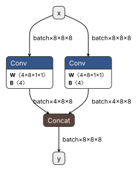

# Minimal Bug Repro Model of OpenVINO Issue openvinotoolkit/openvino#37103

This repo features a minimal model to reproduce the bug in openvinotoolkit/openvino#37103

Requirements: openvino, torch, onnxscript

## Model Structure

This is a rather minimal model, only consisting 2 Conv and 1 Concat between input and output.

See the graph below:

## Result

Utilizing this code, we can verify the issue openvinotoolkit/openvino#37103. See [result.txt](result.txt)

